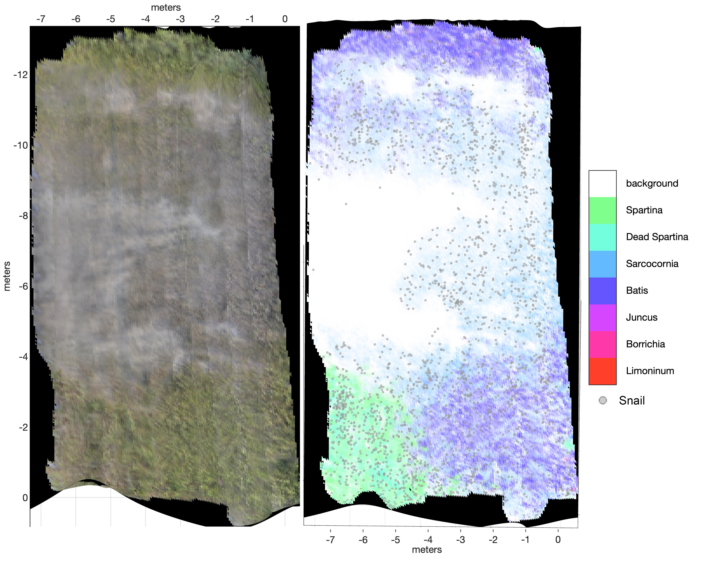

## Multi-Layered Mapping

Tools to transfer information (semantic segmentation, detected objects) onto a triangular mesh from registered images. As illustrated in the diagram below, information from images can be back-projected onto a triangular mesh surface representation of the imaged system if image's pose and its associated camera model are known. Image information to transfer can include class labels, objects, etc and is typically produced automatically using trained machine learning models.

An example of a multi-layered map of a salt marsh is shown below. The map includes plant class information (colors) and locations of individual snails (grey dots).

## Modules
1. **pycamgeom**: python package for camera models and data structures (AABB hierarchy) for accelerating camera projection/backprojection operations.
2. **mesh\_class_labeling**: transfers class information from semantically segmented images onto a triangular mesh
3. **mesh\_object_placing**: backprojects objects detected in images onto a triangular mesh.

