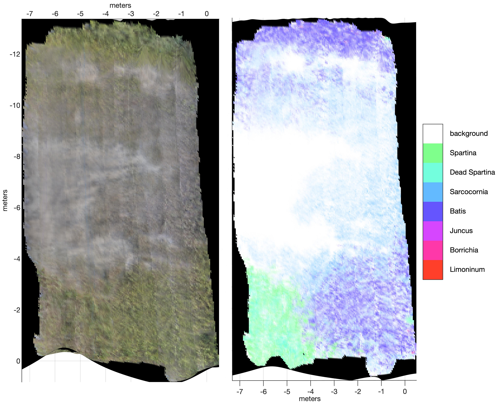

# Class Labeling of Meshes

Uses images registered to a triangular mesh and propagates information (class labels, true color, etc) onto the mesh faces. Currently optimized for use in marshes where classes are very finely interleaved and so each mesh face typically covers multiple classes. To handle this, the program averages class composition in regions of semantically segmented image where a mesh face is projected to obtain fractional cover of classes in mesh face. A similar procedure can be applied with true color images to produce a true color mesh. 

### Implementation Details
* Python3 using trimesh (w/ pyembree for ray tracing), OpenCV, Numpy
* Expects camera registration information and camara calibration data in Agisoft XML format.
* Uses OpenCV camera model (projective camera with radial and tangential distortion)
* The search for mesh components visible in images is accelerated using an AABB tree

### Example Map
The image below is a representation of a section of salt marsh on Sapelo Island, GA.
The section spans a salt pan where most of the ground is open or sparsely covered in the succulent Sarcocornia.
The top and bottom of the section are more densely vegetated, mostly with Batis, Sarcocornia and some Borrichia, but on the lower left a patch of Spartina was present. 
The panel on the left shows the true color mesh. The panel on the right illustrates plant cover where the color of each face is the weighted average of end-member colors representing each plant species. 

